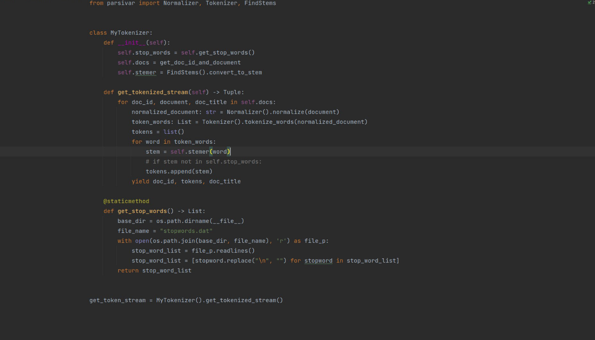
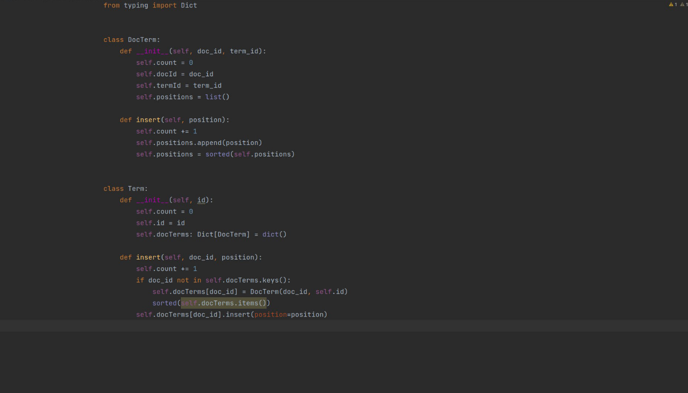
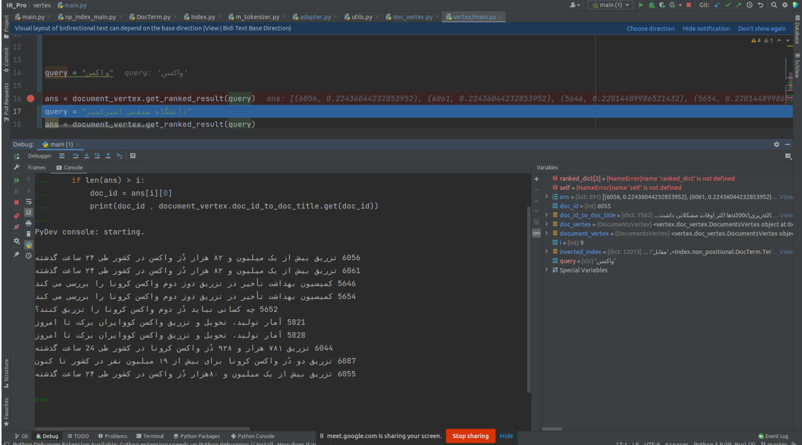
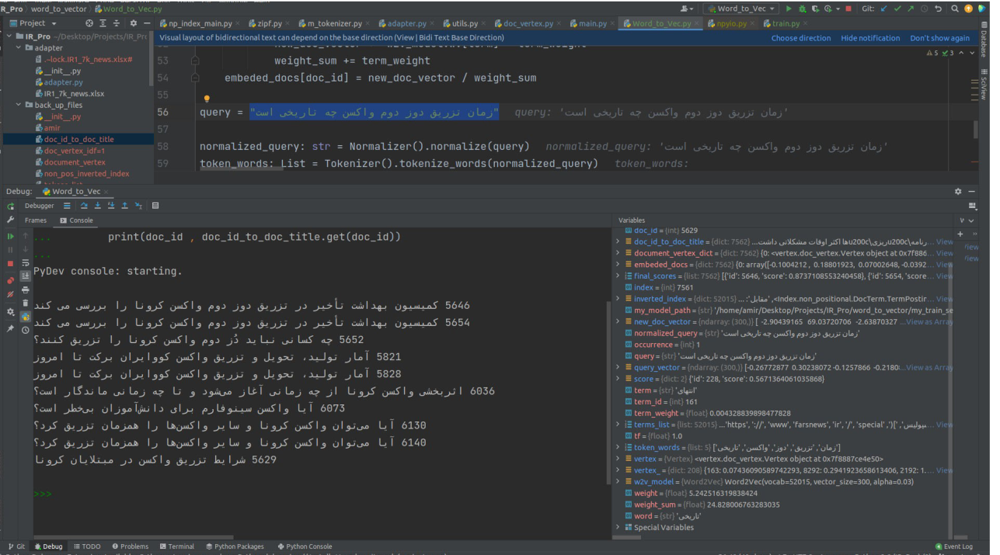

# information_retrieval_final_project

<!-- ABOUT THE PROJECT -->
## About The Project
the aim of the project is to implement a system of information retrival. i thank to Dr.Nick Abadi as the professor of this course .

the project is done in 3 seperate phases .
* in the first phase , i made an inverted index after preprocessing the documents .
Preprocessing includes normalizing the document , tokenizing ,stemming , removing stop words . 
after these steps , the tokens were prepared to crate the inverted index . 
inverted index has the information of each term is appeard in what document and its positions in a certain one .
now it was time to answer the queries of the user .
  this approach was based on the order of words in the queries . if this order is found in a document , it is considered as a candidate answer 
preprocessing step

  

creating inverted index 

  

* in the second phase , we have got to use tf-idf approach . our documents we represented in the vector
it means for each word in the document , we calculated the weight of that word (except stoping words ...)
when we face to a user query , we build the query vector and caculate the Cosin similarity to find the 
most similar document to that query . the result was shown in the ranking sort . the most similar to the least one 

  

  

